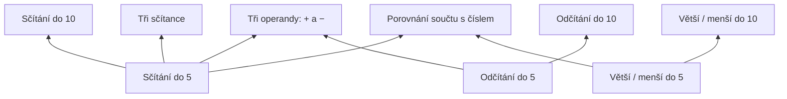

# Číslokraj: plán prvního vydání a dalšího vývoje

Datum: 10. 9. 2026. Stav: návrh k realizaci, založený na čtení aktuálního pracovního stromu a dokumentace služeb. Zahrnuje následné upřesnění: mapa má představovat skutečné větvení učiva, se samostatným postupem sčítání, odčítání a porovnávání v úrovních. Tento dokument neznamená, že infrastruktura je vytvořená nebo že hra prošla novou sadou testů. Doménu považujeme podle potvrzení za zakoupenou; nastavení DNS a účtů služeb zatím nebylo ověřeno. Placenou licenci Suno bereme jako vyřešenou.

## 1. Doporučené rozhodnutí

Pokračovat s jedním repozitářem, samostatným stagingem a produkcí. Hru a web doručovat přes Cloudflare, server a PostgreSQL provozovat na Railway v evropském regionu. Doppler bude zdrojem tajných údajů a konfigurace prostředí. První vydání má být bezplatný český pilot s rychlým vstupem do hraní, spolehlivými savy a kvalitními pozorováními učení.

První ověřovaná smyčka je: dítě začne hrát → zvládne smysluplný úsek → jeho postup se bezpečně uloží → vrátí se → rodič uvidí doložený pokrok → my poznáme, co zlepšit. Rozšiřování obsahu a marketing mají navázat na fungování této smyčky.

Pro pilot doporučuji jasně ohraničený průchod Mathorií a lesem k prvnímu významnému cíli. Je to obsah pro více návštěv; první hraní nesmí podmiňovat pocit úspěchu dokončením celého lesa. Další regiony lze dál vyvíjet a testovat ve stagingu. Přesný seznam dostupných scén musí vzniknout podle skutečných návazností, nikoli podle názvu souboru nebo přípony `Mock`.

## 2. Co už máme a co skutečně chybí

| Oblast | Zjištění v aktuálním kódu | Důsledek pro plán |
|---|---|---|
| Vydávání | Větev `main`, rozsáhlé necommitnuté změny; nebylo nalezeno verzované CI/deploy zapojení. `build` spouští pouze Vite. | Nejprve reprodukovatelný výchozí commit a build z čistého checkoutu. |
| Savy | Osm číselných slotů v localStorage, bez UUID profilu, verze jednotlivého savu a serverové revize. | Verze formátu a migrace před cloudovou synchronizací. |
| Co-op | Střídání hráčů používá synchronní save/load; oba mají vlastní mastery. | Síť musí běžet mimo synchronní herní cestu. |
| Učení | Existuje mastery systém, formy úloh, historie odpovědí a denní přehledy. | Rozšířit skutečné zdroje událostí, nepsat druhý nezávislý učební systém. |
| Návaznosti učiva | Čtyři subskilly se nyní odemykají postupně; další pásmo čeká na všechny čtyři. Porovnávání je formou aritmetických úloh. | Nahradit pevné pořadí grafem skutečných předpokladů a doplnit samostatné porovnávání čísel. |
| Důkazy znalostí | Počáteční umístění může označit přeskočené učivo jako `secure` a vložit 20 úspěšných řešení bez skutečných pokusů. | Rozlišit počáteční nastavení, import a pozorované výkony. |
| Hádanky | Krátké okno pokusů pro adaptaci se po vyhodnocení maže. | Historii pro analýzu uchovávat samostatně jako události. |
| Mapa učení | Pět vodorovných pásů se čtyřmi uzly a rozbalovanými detaily. | Pro požadovaný svislý styl je nutný nový návrh rozložení. |
| Loading | Boot odkazuje na 295 různých textur o součtu 57,12 MiB; UI šablony mají dalších 1,64 MiB zdrojového JSON. | Rozdělit závislosti a měřit první skutečně hratelný stav. Součet není měření síťového přenosu. |
| Audio | Hudba a zvuky se již převážně načítají podle potřeby. | Zachovat tuto cestu a přidat verzované adresy. |

Zdroje v repozitáři: [package.json](/Users/datamole/little-math-adventure/package.json:8), [SaveSystem](/Users/datamole/little-math-adventure/src/systems/SaveSystem.ts:102), [CoopSessionManager](/Users/datamole/little-math-adventure/src/systems/CoopSessionManager.ts:329), [PlacementInitializer](/Users/datamole/little-math-adventure/src/systems/PlacementInitializer.ts:26), [PuzzleService](/Users/datamole/little-math-adventure/src/systems/puzzles/PuzzleService.ts:36), [MasteryMapOverlay](/Users/datamole/little-math-adventure/src/ui/MasteryMapOverlay.ts:146), [BootScene](/Users/datamole/little-math-adventure/src/scenes/BootScene.ts:95).

## 3. Hosting a služby

| Součást | Návrh | Úloha |
|---|---|---|
| Doména a DNS | VEDOS jako registrátor, Cloudflare DNS | Doména může zůstat u VEDOS; pro hosting se mění DNS. |
| Web a hra | Cloudflare Workers Static Assets | Úvodní web, Phaser klient, rodičovská část a tenká `/api` proxy. |
| API | Node.js + TypeScript + Fastify na Railway | Přihlášení, oprávnění, cloudové savy, příjem událostí a reportů. |
| Databáze | PostgreSQL na Railway, EU West / Amsterdam | Účty, vazby rodič–profil, revize savů, události a agregace. |
| Herní média | Veřejný Cloudflare R2 bucket | Neměnné verzované textury, zvuky a obsahové manifesty. |
| Soukromé přílohy | Samostatný privátní R2 bucket s EU jurisdikcí | Dobrovolné screenshoty reportů; přístup jen přes oprávnění serveru. |
| Přihlášení rodičů | Better Auth na našem API, e-mailový odkaz | Účet rodiče bez požadavku na e-mail dítěte; odesílání přes transakční e-mailovou službu. |
| Technické chyby | Sentry pro klienta a API | Stack traces, přiřazení k vydání, soukromé source maps, seskupování chyb. |
| Produktové hlášení | Vlastní formulář + admin inbox | Chyby, nápady a nesrozumitelná zadání v kontextu hry. |
| Konfigurace | Doppler | Oddělené nastavení lokálního vývoje, stagingu a produkce. |

Cloudflare dnes pro nové projekty doporučuje Workers Static Assets. Railway má evropský region v Amsterdamu a soukromou síť uvnitř prostředí; databázi necháme bez veřejného přístupu. [Cloudflare doporučení](https://developers.cloudflare.com/workers/best-practices/workers-best-practices/), [Railway regiony](https://docs.railway.com/deployments/regions), [soukromá síť](https://docs.railway.com/networking/private-networking/how-it-works).

Navržené adresy: `cislokraj.cz/` pro vstupní stránku, `/hra/` pro hru, `/rodice/` pro rodiče, `/api/` pro API. Společný origin zjednoduší cookies a přihlášení. `staging.cislokraj.cz` bude mít stejné cesty a vlastní data. Veřejné assety mohou být na `assets.cislokraj.cz`.

Worker přeposílá pouze `/api/*` na konkrétní Railway službu; API odpovědi se necachují. API, auth a runtime konfigurace mají přednostní routování bez SPA fallbacku. Vyřešit předávání cookies, omezení velikostí požadavků, důvěryhodné proxy hlavičky a serverové ověření volání z proxy. Hra nesmí znát DB přístup ani infrastrukturní token. Autentizace a kontrola vlastnictví probíhají i na API, nezávisle na proxy.

Při převodu DNS nejprve opsat potřebné záznamy, zkontrolovat případný současný DNSSEC a provést změnu v bezpečném pořadí podle aktuálního stavu. Poté ověřit HTTPS a znovu nastavit DNSSEC u nového DNS provozovatele. Tohle je krok realizace, ne již provedená změna.

R2 umí EU jurisdikci; pouhý lokalizační hint jí není roven. Volba evropské DB nebo bucketu sama nezaručuje evropské zpracování všech logů, e-mailů a podpůrných služeb. [R2 umístění dat](https://developers.cloudflare.com/r2/reference/data-location/).

Pro začátek stačí jedno API a jedna DB na prostředí. Agregace může zpočátku zpracovávat úlohy uložené v PostgreSQL. Redis, datový sklad, samostatné mikroservisy ani autoritativní bojový server nejsou předpokladem pilotu. Nastavit nákladové upozornění a sledovat náklady na aktivního hráče; ceny konkrétních tarifů ověřit při zakládání služeb.

## 4. Jeden repozitář, dvě nezávislá nasazení

```text
feature/* → kontrola změn → main → automatický staging
                                ↓ otestovaný kandidát
                        tag v0.1.0 → produkce

main pokračuje dál; produkce pořád používá v0.1.0
oprava starého vydání: release/0.1 → v0.1.1 → přenést opravu do main
```

Tag určuje konkrétní commit, produkce konkrétní sestavený artefakt. Fork by přidal správu rozdílů, dvojí opravy a další místo pro rozcházení dat. Pro souběžné lokální spuštění stabilní verze použijeme další Git worktree. Stávající `main` není nutné přejmenovávat ani zavádět trvalou větev `develop`.

Před prvním vydáním:

1. Z aktuální rozpracované hry vybrat a zkontrolovat soubory pro výchozí commit. Nepoužít plošné přidání všeho.
2. Doplnit ignorování `.env*`, dočasných souborů a `tmp/`. V `tmp/pdfs` jsou soukromé doklady, které nesmějí do Git historie, CI kontextu ani distribučních archivů.
3. Editorové SQLite databáze jsou již sledované přes Git/LFS. Vyřešit jejich vyřazení z verze zdrojů při zachování lokálních souborů a potřebných runtime obrázků; samotné přidání do `.gitignore` nestačí.
4. Oddělit veřejně dostupné scény, debug nástroje a vývojové vstupy. Zachovat skutečné produkční návaznosti a zdrojové JSON katalogy.
5. Chránit `main`, produkční nasazení a release tagy. Preview změn používají testovací data a nemají produkční tajné údaje.

Současná struktura může zůstat; postupně přidat `server/`, `packages/contracts/` pro sdílená schémata a `packages/learning-core/` pro čisté učební výpočty bez Phaseru. Rodičovské rozhraní bude lehká webová aplikace. Velký přesun všech souborů do monorepo šablony by zbytečně komplikoval první krok.

CI kandidáta: čistý checkout včetně skutečných LFS souborů → `npm ci` → kontrola migrací a typecheck → relevantní testy → validace katalogů a manifestů → produkční build → kontrola publikovaných souborů → E2E nad buildem → staging. `vite build` není kontrola TypeScriptu; aktuální úspěšnost celé této brány musí teprve být doložena.

Produkce povyšuje stejné otestované frontendové soubory a stejný backendový image digest. Railway produkční služba nesmí automaticky stavět aktuální `main`; redeploy po změně v Doppleru znovu spustí tentýž připnutý image. Revizi konfigurace evidovat vedle verze kódu. Veřejná konfigurace prostředí se doplní při běhu z omezeného endpointu, aby kvůli stagingové URL nevznikal jiný frontendový build. Verze obsahu a učebních pravidel zůstává součástí vydání.

`release-manifest.json` ponese build ID, commit, hash assetového manifestu, verzi obsahu, učební politiky, save formátu, událostí a podporovaného API. Na serveru evidovat i požadované DB migrace.

Rollback musí zahrnovat klienta, dostupnost jeho assetů a kompatibilitu API i savů. Nejprve přidávat kompatibilní DB změny a nasadit server obsluhující současné i předchozí klienty; následně frontend. Produkční migrace spouštět jednou pod zámkem uvnitř soukromé Railway sítě; CI má vlastní migrovanou testovací DB. Destruktivní změny odložit do samostatného kroku. Návrat HTML na předchozí verzi nesmí automaticky vracet DB schéma ani přepsat novější savy. Nepodporovanému klientovi nabídnout bezpečný update před zápisem.

## 5. Doppler jako zdroj konfigurace

Projekt `cislokraj`, konfigurace pro `dev`, `stg`, `prd`; přístup rozdělený podle služby a prostředí. Lokální API spouštět přes Doppler CLI. Produkční hesla nepřenášet na vývojové stroje a nevytvářet skutečné `.env` v repozitáři.

Doppler má nativní průběžnou synchronizaci do Railway včetně volby služby a redeploye po změně. Dokumentace upozorňuje, že pro tuto integraci nefungují Railway project-specific tokeny; při nastavení je nutné ověřit správný typ a rozsah přístupu. Pro produkční rotace nastavit řízený postup, aby změna DB hesla neodpojila API. [Integrace Doppler–Railway](https://docs.doppler.com/docs/railway).

Cloudflare Workers nasazovat přes CI s Doppler CLI a Wranglerem. GitHub může získávat krátkodobý přístup k Doppleru pomocí OIDC, pokud to dovoluje zvolený tarif a nastavení; jinak použít omezený bootstrap token. OIDC vazbu omezit na konkrétní repo a prostředí. Prvotní přístup k Doppleru se logicky nedá čerpat sám ze sebe. [Doppler GitHub OIDC](https://docs.doppler.com/docs/github-oidc-examples).

V Doppleru spravovat DB údaje, auth secret, e-mailové a R2 klíče, deploy tokeny a serverovou konfiguraci. Platformou přidělené údaje jako porty či interní DNS mají jasně definované mapování; nevyvolávat kruhovou synchronizaci. Veřejný klient dostane pouze výslovně povolené hodnoty. Cokoliv v `VITE_*` může skončit v prohlížeči a nesmí obsahovat tajný údaj. Doppler uchovává konfiguraci; savy a výuková data patří do aplikačního úložiště.

## 6. Cloudové savy a přihlášení

Dítě může začít bez registrace: místní profil s UUID, avatarem a volitelnou přezdívkou. Rodič se přihlásí e-mailovým odkazem a převezme vybrané profily do účtu. Je nutné výslovně ukázat, které z lokálních slotů připojuje; současný export všech slotů nelze automaticky považovat za jedno dítě.

Better Auth nabízí e-mailové přihlášení a serverové relace; doporučuji použít tuto knihovnu a nenavrhovat vlastní tokenový autentizační protokol. Vedle ní bude náš model rodiny, profilů a oprávnění. [Magic link](https://better-auth.com/docs/plugins/magic-link), [správa relací](https://better-auth.com/docs/concepts/session-management).

Rodičovská relace používá bezpečnou HTTP-only cookie a ochranu změnových požadavků. Spárované dětské zařízení získá pouze oprávnění k povoleným herním profilům; rodičovská správa vyžaduje nové ověření. Připojení dalšího zařízení může proběhnout krátkým jednorázovým kódem s expirací a možností odvolání. Otevření běžné herní obrazovky nesmí poskytovat rodičovská oprávnění. Samotná znalost `profileId` nesmí umožnit převzetí cizího profilu; první připojení místního profilu a párování již vlastněného cloudu jsou odlišné serverové operace.

Při realizaci kroku 1 vybrat transakční e-mailovou službu podle doručitelnosti, zpracování dat a aktuálních tarifů, ověřit odesílací doménu a nastavit SPF/DKIM. Před pilotem ověřit callback přes veřejné `/api/auth`, expiraci a jednorázovost odkazu i otevření e-mailu v jiném prohlížeči či zařízení. Volba dodavatele e-mailu je dosud otevřený infrastrukturní detail; není nutné kvůli ní měnit model účtů.

### Model a synchronizace

Verzovaná save obálka: `profileId`, `saveSchemaVersion`, `buildId`, `contentVersion`, `baseRevision`, `mutationId`, `deviceId`, typ checkpointu, kontrolní součet a payload. Číslo slotu zůstává místním pořadím, nikoliv globální identitou.

Zachovat synchronní přístup ke stavu hry. Přidat lokální repository a trvalou frontu v IndexedDB pro asynchronní odesílání. Stav „uloženo v zařízení“ potvrdit až po úspěšném trvalém zápisu, stav „zálohováno“ až po potvrzení serverem. Při vyčerpání úložiště nabídnout jasné hlášení a export. Hra nesmí hlásit úspěch pouze proto, že `save()` chybu zalogovalo.

Snapshoty pořizovat v bezpečných checkpointových přechodech, po významné odměně a při změně profilu; síťové požadavky slučovat. `pagehide` může pomoci, ale nesmí být jedinou cestou zápisu. Pro pilot definovat návrat do posledního bezpečného checkpointu, nikoliv slib obnovy libovolného snímku rozběhnutého boje. Odměna, její dokončovací příznak, checkpoint a odpovídající odchozí operace se ukládají v jedné lokální IndexedDB transakci. Společná co-op odměna zahrne oba profily a jedno stabilní ID operace; potvrzení na serveru musí zachovat stejnou atomickou hranici.

Server přijme zápis pouze proti očekávané revizi. Opakované `mutationId` vrátí původní výsledek. Při konfliktu dvou zařízení zachová obě varianty a rodič zvolí pokračování podle srozumitelného popisu. Automatické „nejnovější čas vyhrává“ ani maximum mincí, inventáře a postupu nejsou bezpečné slučování. Také dvě karty stejného prohlížeče musí koordinovat zápisy.

U co-op uložit identitu hráče již při vzniku úlohy nebo vložení do fronty. Pozdější odpověď serveru nesmí být přiřazena právě aktivnímu sourozenci. Oba profily uchovávají své savy a své učební události.

Migrace přečtou současné klíče localStorage a zachovají zálohu původního savu. Změna názvu produktu není důvod klíče zahodit. Import je opakovatelný bez duplicit a bez přepsání existujících slotů. Přenos ze staré domény nebo localhostu potřebuje export/import, protože prohlížečový storage je oddělený podle originu. Starou historii označit jako importovanou, nedoplňovat zpětně vymyšlené odpovědi ani časy.

### Zálohy a dostupnost

Nastavit plánované zálohy PostgreSQL, pokud možno obnovu k bodu v čase, a pravidelný oddělený logický export. Ověřit šifrování, přístupy, umístění a obnovu. Railway dokumentuje volume snapshoty, PITR a logické exporty; dostupnost i konkrétní nastavení ověřit pro zvolený provoz. [Zálohy Railway PostgreSQL](https://docs.railway.com/guides/postgres-backups-restores).

Navržený cíl pilotu: obnovit službu do čtyř hodin, serverová ztráta potvrzených dat nejvýše 15 minut při funkčním PITR. Jde o cíle k praktickému ověření, ne poskytovanou garanci; běžná synchronizace má zachovávat všechna potvrzená data, katastrofická obnova má odlišné limity. Místní fronta se drží do potvrzení serverem a poslední místní checkpoint se uchová i po potvrzení. Po obnově DB může být klient novější než server; revize proto musí obsahovat jedinečný identifikátor nebo recovery epoch, aby číselná revize nemohla označit jiný obsah. Nacvičit opětovnou synchronizaci takového klienta bez tichého přepsání. Počet uchovaných save revizí a doba záloh budou omezené. Obnovu nacvičit do izolované DB, včetně kontroly účtů, historie a nového bezpečného nasazení.

## 7. Data o učení a rodičovský přehled

Chceme co nejvíce použitelných pozorování, ze kterých lze rozlišit správný postup, konkrétní chybu, potřebu pomoci a skutečné zlepšení. Počet kliknutí sám toto nevysvětlí.

Rozdělit ukládání podle účelu:

| Datová oblast | Obsah | Použití |
|---|---|---|
| Účet a vlastnictví | Rodičovský účet, připojené profily, oprávnění zařízení, volby zpracování | Přihlášení, synchronizace, přístup rodiče |
| Savy | Aktuální stav + omezená historie revizí | Obnovení dobrodružství |
| Výukové události | Strukturovaná pozorování pod pseudonymním ID | Osobní pokrok, analýza učebních mechanismů |
| Souhrny | Denní/skillové agregace a verze jejich výpočtu | Rodičovská mapa a interní analýza |
| Diagnostika a feedback | Technický kontext, chyby, dobrovolné reporty | Opravy a produktové návrhy |

Dokud umíme profil propojit s rodičem nebo sledovat stejné dítě v čase, jde o pseudonymizovaná osobní data. Skutečně anonymní budou až vhodně zpracované agregace bez možnosti zpětného přiřazení. [Evropská komise: osobní a pseudonymizované údaje](https://commission.europa.eu/law/law-topic/data-protection/information-business-and-organisations/application-gdpr_en).

Před pilotem popsat konkrétní účely a právní tituly: základní provoz/savy a rodičovský přehled oddělit od volitelného širšího výzkumu či experimentů. Pro pilot získat srozumitelný souhlas rodičů s volitelným sběrem; možnost odmítnout jej nesmí blokovat místní hraní. Provozní údaje mít pod vlastním doloženým režimem. Ověřit podmínky pro dětské uživatele, smlouvy zpracovatelů a případné předávání mimo EU podle skutečně zapojených služeb. Toto není tvrzení, že pouhé přejmenování ID řeší GDPR.

Navržená výchozí retence k potvrzení před sběrem: detailní výukové události šest měsíců, diagnostika 30 dní, screenshoty reportů 30 dní; rodičovské souhrny po dobu aktivního účtu s transparentní politikou neaktivity. Delší výzkumné uchování zavést pouze s odůvodněním a odpovídajícím režimem. Export a výmaz zahrnou profily, vazby, události, odvozené souhrny a přílohy; obnova záloh musí znovu uplatnit evidované výmazy. Potenciálně identifikovatelné malé skupiny nepublikovat jako „anonymní“ statistiku.

### Události první verze

- Zobrazení, odpověď a opuštění příkladu; zobrazení nápovědy a dokončení vysvětlení.
- Začátek, pokusy, pomoc, dokončení a opuštění hádanky.
- Výsledek zkoušky, změna mastery, počáteční zařazení a jeho původ.
- Začátek sezení, důležité kroky tutorialu, dokončení scény/boje a důvod přerušení, pokud je známý.
- Časy spuštění, načítání balíku a stav synchronizace jako oddělené provozní události.

Každé pozorování má UUID, verzi schématu, ID prezentované úlohy, profil, session, pořadí v zařízení, klientský a serverový čas, build a verzi učebních pravidel. Pro matematiku přidat skill, formu, zadání/operandy nebo reprodukovatelný klíč a seed generátoru, nabídnuté možnosti, skutečně zvolenou hodnotu, první pokus/opravu, pomoc, aktivní čas odpovědi a čas pauzy. Uložit scénu, encounter a roli v co-op. Citlivé údaje nepatří do volného `metadata`.

Tak zjistíme například rozdíl mezi chybou v přenosu přes desítku a náhodným tipováním. Rozdíl mezi promýšlením prostorové hádanky a vybavením jednoduchého početního spoje musí zůstat zachován. Otevřená neaktivní karta se nezapočítává jako pomalé řešení. Zobrazená nápověda neznamená, že dítě text pochopilo.

Události posílat v dávkách z trvalé lokální fronty. API ověřuje vlastnictví profilu, schéma, limity a jedinečnost event UUID. Potvrdit až trvalý DB zápis; následná agregace může doběhnout asynchronně. Čas z klienta není důvěryhodné globální pořadí. Chybně tvarované nebo neověřitelné importy nesmějí zkreslit hlavní metriky.

Události z obou offline větví lze uchovat pro analýzu, pokud jsou platné a oprávněně sbírané. Nesmějí se bez definované politiky znovu přehrát do herních odměn a mastery. Obnova savu a učební analýza jsou odlišné operace.

První rodičovský přehled: co dítě procvičovalo, samostatná přesnost prvního pokusu, rozsah pozorování, pomoc, změna v čase, poslední procvičení a vhodný další krok. Vždy ukázat poslední synchronizaci a „zatím málo dat“, když chybí důkazy. Příklad textu: „Za poslední tři dny vyřešil samostatně 14 ze 16 úloh tohoto typu.“ Jde o příklad prezentace, ne naměřený výsledek.

Počáteční zařazení zobrazit jako „výchozí úroveň – zatím neověřeno“. Herní bronzová medaile nebo odemčená oblast není sama důkaz dlouhodobého osvojení. Report pro jedno dítě nesmí směšovat společnou co-op časovou osu.

Pro první implementaci sdílet verzovaný katalog a čisté výpočty mezi hrou a serverovými souhrny. Nový katalog zahrne větvení popsané níže; jedna úroveň hráče nevystihne jeho různé úrovně sčítání, odčítání a porovnávání. Další kalibrace výuky musí být verzovaná a vyhodnotitelná na stejných událostech. Nestačí porovnávat dvě procenta z odlišně obtížných sad příkladů.

## 8. Mastery mapa inspirovaná dodaným obrázkem

Výsledkem má být rozvětvená ilustrovaná mapa: úrovně tvoří vodorovné výškové vrstvy nebo území, jednotlivé dovednosti vlastní větve. Mezi nimi jsou jen smysluplné návaznosti a soutoky. Mapa může rolovat nahoru, ale nemá jednu povinnou hlavní cestu ani jednu pozici, která shrnuje celé dítě. Vizuální inspirace je kompozice a čitelnost přiloženého obrázku; grafiku a symboly vytvoříme v jazyce Číslokraje.

Území mohou vyjít ze současných číselných pásem, jejich přesné hranice ale ověřit proti katalogu a novým návaznostem. Uzly budou pojmenované lidsky, například „Sčítání do 5“, a budou mít stabilní ID. Interní A1/atomy nebudou hlavní dětský popisek.

Základ tvoří tři nezávislé větve: sčítání, odčítání a větší/menší/rovná se. Mohou být dostupné současně v počáteční úrovni. Zvládnutí sčítání není podmínkou, aby dítě vůbec mohlo procvičovat základní odčítání nebo porovnávání čísel. Každá větev má svůj postup do vyšších rozsahů. Doporučuji umožnit například sčítání do 10 při současném procvičování odčítání do 5.

| Navazující uzel | Skutečně potřebné základy | Co nemá být umělou překážkou |
|---|---|---|
| Sčítání ve vyšším rozsahu | Sčítání v předchozím rozsahu a potřebné porozumění číslům | Pomalejší postup v odčítání |
| Odčítání ve vyšším rozsahu | Odpovídající základ odčítání | Nedokončená výzva na rychlé sčítání |
| Porovnávání čísel | Porozumění velikosti čísel v daném rozsahu | Aritmetické zkoušky |
| Tři sčítance, např. `2 + 1 + 2` | Sčítání v příslušném rozsahu | Odčítání, pokud se v zadání nepoužívá |
| Tři operandy se smíšenými operacemi, např. `4 − 2 + 1` | Sčítání i odčítání v příslušném rozsahu | Mistrovství v nesouvisejících formách |
| Porovnání výrazu s číslem, např. `2 + 1 > 2` | Porovnávání + použité sčítání | Nepoužitá operace |
| Porovnání dvou výrazů, např. `2 + 1 ? 5 − 1` | Porovnávání + všechny skutečně použité operace | Dokončení všech ostatních větví |



Schéma ukazuje princip návazností, nikoliv finální umístění nebo úplný seznam učiva. Výtvarná mapa bude mít zakřivené cesty, různé vzdálenosti a otevřený prostor. Plynulost, mistrovství a návraty k procvičení doplní větve, ale skutečné větvení vytvářejí samotné druhy úloh. Žádná volba neuzamkne souběžnou větev.

### Změna učebního modelu, kterou tento návrh vyžaduje

Současný lineární řetězec není požadavek, který musíme zachovat; po upřesnění ho měníme. Zavést `SkillGraph` jako společný zdroj pravidel pro odemykání, generování úloh, adaptaci, zkoušky, mapu a rodičovské souhrny. Uzly mají stabilní ID, operaci, rozsah, požadované předchůdce a kritéria zvládnutí. Oddělit závislosti (`requires`), doporučení (`offers`) a souřadnice mapy. Příběhové regiony jsou další rozměr, nemají samy definovat osvojení všech početních operací.

Posun sledovat po větvích. Výběr úloh pracuje s množinou dostupných skillů, vybraným cílem, opakováním a přiměřenou zátěží. Doporučení pomáhá vyváženému procvičování; pomalejší větev nezastaví všechny ostatní a oblíbená snadná větev nesmí úplně vytlačit ostatní potřeby. Celkové zkoušky pásma mohou zůstat jako dobrovolné souhrnné výzvy, jejich dnešní odemykací funkci je nutné přepracovat.

Společný profil schopností musí používat boj, příprava v obchodě, mana, mazlíčci, hádanky i jejich fallbacky. Evidovat rozsahy a přechod přes desítku zvlášť pro operace. Společná co-op úloha se řídí průnikem skutečně potřebných schopností obou hráčů. Dnešní snížení celého pásma při obtížích nahradit pomocí v postižené větvi. [ManaPlayerLane](/Users/datamole/little-math-adventure/src/ui/ManaPlayerLane.ts:285), [PuzzleDifficulty](/Users/datamole/little-math-adventure/src/systems/puzzles/PuzzleDifficulty.ts:8).

Každý skill potřebuje vlastní smysluplná kritéria ověření a povolené formy. Dnešní univerzální zkouška s výsledkem, chybějícím operandem a aritmetickým porovnáním se nehodí pro samostatné větší/menší. Ani požadavek více forem nesmí nutit doplňovat nesouvisející aritmetiku. Rozdělení uzlů zároveň nesmí automaticky přidat další HP/útok: odměny oddělit od prostého počtu uzlů a zachovat již získané odměny v migraci. [Zkoušky](/Users/datamole/little-math-adventure/src/systems/MasterySystem.ts:788), [ExamProgress](/Users/datamole/little-math-adventure/src/systems/ExamProgress.ts:3).

Závislosti musí mít také konkrétní úloha. Dnešní databáze například umí do porovnání vedeného jako sčítání vložit odčítání na pravou stranu a ve tříoperandovém bucketu míchá `++`, `+−`, `−+`, `−−`. Pouhé odemknutí uzlu by dítěti stále předkládalo nepřipravené operace. Doplnit filtr skutečných předpokladů a samostatné porovnávání číslo–číslo, které současné `ProblemForm` nemá. [ProblemDatabase](/Users/datamole/little-math-adventure/src/systems/ProblemDatabase.ts:128), [typy forem](/Users/datamole/little-math-adventure/src/types/index.ts:479).

Každý pokus má hlavní procvičovaný skill a seznam použitých dovedností. Jedna správná smíšená odpověď se nesmí bez pravidla započítat jako několik samostatných důkazů. Z chybného složeného výrazu nelze automaticky určit, kterou dílčí operaci dítě neovládá; takovou hypotézu má ověřit vhodná další úloha.

Nový model verzovat a migrovat ze starého: zachovat skutečné pokusy, dosažené herní odměny a průchod příběhem. Starší agregace, které nelze poctivě rozdělit do nových skillů, uchovat s původem; nevytvářet smyšlené výsledky nové porovnávací větve. Počáteční umístění potřebuje profil po větvích nebo nejprve orientační společný start s následným ověřením. Uživatel nesmí přechodem přijít o dobrodružství.

Akceptace modelu: graf nemá cykly, každá startovní větev má řešitelné úlohy, složená úloha čeká na všechny potřebné základy, pomalé odčítání nezablokuje další sčítání, žádná větev neuvízne bez dostupných úloh a migrace nezdvojí odměny. Ověřit také všechny herní systémy, které dnes předpokládají jediné nejvyšší pásmo.

Stavy: budoucí/zamčeno, dostupné, právě procvičované, jistota, plynulost, mistrovství; případné doporučení zopakovat je další značka, nikoliv trestající ztráta dosažené odměny. Současně může být dostupných více uzlů v různých větvích. Použít kombinaci tvaru, ikony a barvy, stručnou legendu a jasný výběr; zvýrazněné doporučení není jediná povolená cesta. Žádné falešně přesné procento ovládnutí bez podloženého významu.

Kliknutí otevře detail vedle mapy na desktopu a přehledný panel na tabletu. Dětský detail řekne „co už umím“ a nabídne jeden srozumitelný další krok. Rodičovská verze stejné mapy navíc ukáže formy úloh, samostatnost, historii, počet pozorování a příklady obtíží. Sdílet data a význam stavů; dětská Phaser mapa a přístupný web pro rodiče mohou mít různé renderery.

Nejdříve navrhnout a vizuálně zkontrolovat jedno území se skutečnými stavy: nový hráč, dítě se smíšenými výsledky, pokročilé počáteční zařazení, málo dat a offline profil. Až potom rozšířit výtvarné řešení na všechna pásma. Přijmout konkrétní desktopový a tabletový návrh, ne pouze schéma uzlů.

Dodržet [ASSET_CREATION.md](/Users/datamole/little-math-adventure/docs/ASSET_CREATION.md): společné rámečky, vrstvené ikony se stabilními stavy, runtime české texty, bezpečné vnitřní okraje a zachované proporce obrázků. Statické hosty, oblasti mapy a detailů patří do `scenes.json`; uzly a spojnice do verzovaných dat rozložení pro editor. Dnešní `learningMapOverlayHost` lze využít jako vstupní bod.

Akceptace: skutečně prohlédnuté screenshoty na desktopu a tabletu, dotykové posouvání bez nechtěných kliků, ovládání klávesnicí, dlouhé české popisky, vybraný/hover/pressed/disabled stav, barvoslepost, WebGL i Canvas a žádné překrývání. Kompletní výtvarná mapa všech území může pokračovat po uzavřeném pilotu; správný význam dat a první použitelný rodičovský pohled musí vzniknout před ním.

## 9. Technické chyby a hlášení podle FakturoKrabu

V Downloads byly podklady a exporty; skutečná implementace byla nalezena v `/Users/datamole/fakturoKrab`. Kontrola byla statická, nikoli ověření nasazené aplikace.

FakturoKrab má typy Chyba / Zlepšení / Přání, volitelný screenshot, API s validací, privátní přílohy a admin inbox se stavy `new → triaged → in_progress → done / dismissed`. Jeho technické chyby sbírá vlastní client logger a serverová tabulka, nikoli Sentry. [Formulář](/Users/datamole/fakturoKrab/packages/osvc/client/src/components/FeedbackButton.tsx:127), [příjem reportu](/Users/datamole/fakturoKrab/packages/osvc/server/src/modules/core/routes/feedback.ts:93), [admin inbox](/Users/datamole/fakturoKrab/packages/osvc/client/src/modules/admin/pages/AdminFeedback.tsx:125), [client error logger](/Users/datamole/fakturoKrab/packages/osvc/client/src/lib/clientErrorLogger.ts:72).

Převzít produktový vzor formuláře a inboxu. Technické exceptions doporučuji svěřit Sentry kvůli source maps, seskupování a vazbě na vydání. Vlastní reporting zůstane potřebný i vedle něj.

Ve hře nabídnout „Něco nefunguje“, „Nerozumím zadání / je moc těžké“ a „Mám nápad“. Rodič může doplnit text. Kontext: scéna, pokoj, encounter, problem ID, role hráče, verze hry/obsahu/save, renderer, základní zařízení, loading a sync stav. Připojit krátký strukturovaný seznam posledních akcí, například posledních 30 položek podle povoleného schématu.

Screenshot pouze dobrovolně s náhledem před odesláním; zachytit herní plochu a skrýt přezdívky či rodičovská data. U Phaseru ověřit snapshot API rendereru; `html2canvas` z FakturoKrabu nemusí správně zachytit WebGL canvas. Přílohy ukládat privátně s krátkodobým podepsaným přístupem a omezenou retencí. Report musí fungovat i bez obrázku.

Formulář má trvalou offline frontu, UUID proti duplikacím a stavy „uloženo v zařízení“ / „odesláno“. Přijetí nehlásit před trvalým serverovým uložením. Admin vidí typ, stav, počet souvisejících výskytů, build, kontext, interní poznámky, vazbu na chybu a vydání opravy. Není potřeba automaticky zveřejňovat reporty do veřejných GitHub issues.

Sentry nastavovat pro konkrétní uzamčenou verzi SDK: explicitně vymezit sbíraná pole, filtrovat URL a query, cookies, hlavičky a těla požadavků; vypnout automatické console breadcrumbs s herním stavem. Nezapínat Session Replay ani posílání plných savů. Aktuální dokumentace upozorňuje, že nové nastavení `dataCollection` může mít jiné výchozí hodnoty než starší `sendDefaultPii`; konfiguraci ověřit zachycením skutečně odesílaného payloadu. [Sentry: sbíraná data](https://docs.sentry.io/platforms/javascript/data-management/data-collected/).

FullStory vazbu na jméno/e-mail uživatele z FakturoKrabu do dětské hry nepřebírat. Sentry neslouží jako úložiště syrové historie matematických odpovědí. Runtime i server musí sanitizovat data a omezovat příjem; pouhá klientská validace není ochrana veřejného endpointu.

Monitorovat zejména nárůst pádů po vydání, neúspěšné načtení, neuložené savy, konflikty, chyby přihlášení a zpoždění příjmu událostí. Upozornění musí odkazovat na konkrétní vydání a postup řešení. Testovací chyby ze stagingu oddělit od produkce.

## 10. Postupné načítání a neměnné assety

Přidat generovaný manifest závislostí: `scenes.json → assets.json → textures.json`, dále UI šablony, nine-slice konfigurace, animace, spritesheety, encountery, nepřátelé, mazlíčci a explicitně deklarované textury dynamického UI. Sdílené podklady deduplikovat. Sestavovat publikované soubory podle skutečných runtime potřeb a kontrolovat zbylé neveřejné soubory.

Navržené balíky: minimální shell/loading → menu a výběr postavy → tutorial/první souboj → Mathoria → les → Silverpond → podvodí. Společný HUD má vlastní balík; boj si připraví konkrétní roster a vybavení. Podle potřeby rozdělit i velká data šablon a importy scén v JavaScriptu.

Současný `SceneBuilder` synchronně vytváří všechny elementy včetně skrytých a některé assety okamžitě spouštějí animaci. Proto musí být závislosti připravené před `buildScene()` a animace registrované až po načtení jejich textur. Nestačí odfiltrovat obrázky při bootu. [SceneBuilder](/Users/datamole/little-math-adventure/src/systems/SceneBuilder.ts:29), [AssetFactory](/Users/datamole/little-math-adventure/src/systems/AssetFactory.ts:114).

Na pozadí přednačítat nejpravděpodobnější další scénu až po zprovoznění aktuální hry, například les při pobytu ve městě. Omezit souběh a paměť, respektovat úsporné připojení a nezhoršovat plynulost právě hrané scény. Před vstupem ověřit dokončení balíku; při výpadku ukázat srozumitelný průběh, retry a bezpečný návrat. Loader musí mít své malé závislosti dostupné předem.

Verzované soubory ukládat pod neměnnou cestu `/releases/<build-id>/…` a dlouze cachovat. Zahrnout i později načítané JS chunky, CSS a případný WASM, nejen obrázky a audio. Při přesunu médií do R2 uchovat také tyto závislosti ve verzovaném úložišti nebo v neměnném nasazení vydání. Klient si při startu připne manifest své verze a ten používá i pro další kapitoly. Shell má krátkou cache. Starší soubory uchovat po celou podporovanou dobu otevřených klientů; odstranění řídit politikou podporovaných verzí, nikoli okamžikem dalšího deploye. Chybějící chunk nebo JSON musí vrátit chybu, ne SPA fallback s HTML.

Převést také dnešní absolutní `/assets/...` adresy přes společný resolver. [UiTemplateLoader](/Users/datamole/little-math-adventure/src/systems/UiTemplateLoader.ts:80) dnes při neúspěšném fetchi pouze loguje a pokračuje; veřejné sestavení potřebuje skutečný chybový stav. Audio se nemá znovu celé zařadit do bootu.

Cloudflare Workers má limit velikosti jednotlivého statického assetu 25 MiB; sestavování musí tento i další limity ověřovat. R2 pomůže oddělit rozsáhlá verzovaná média od webového nasazení. [Limity Workers](https://developers.cloudflare.com/workers/platform/limits/).

Počáteční rozpočty k ověření: do funkčního menu nejvýše 4 MiB přenosu, do prvního souboje kumulativně nejvýše 12 MiB. Cíl první obraz do 2 sekund a funkční menu do 5 sekund na definované síti 10 Mb/s / 100 ms. To nejsou naměřené výsledky; první souboj se bude měřit samostatně, protože 12 MiB nelze na této síti stáhnout za pět sekund.

Měřit studenou a teplou cache, odchod během loadingu, dekódování, JavaScript parse, snímkování a GPU paměť na reálném tabletu. Malý WebP soubor může po dekódování zabírat velkou texturu. Správa síťové cache a uvolňování nepotřebných GPU textur jsou dvě oddělené věci.

## 11. Pořadí práce a konkrétní výstupy

| Krok | Výstup | Hotovo, když |
|---|---|---|
| 0. Výchozí verze | Kontrolovaný commit, veřejný build profil, seznam vydávaného obsahu, ochrana neveřejných souborů | Čistý checkout vytvoří stejnou hru se skutečnými LFS assety; distribuce neobsahuje tajné údaje, doklady ani editorové DB. |
| 1. Staging a Doppler | Cloudflare, Railway API/DB, oddělená prostředí, CI kandidáta, prvotní chybový monitoring | HTTPS funguje, API má health check, tajné údaje neunikají do klienta, deploy i návrat kandidáta jsou reprodukovatelné. |
| 2a. Větvení učiva | `SkillGraph`, skutečné předpoklady úloh, samostatné porovnávání, verze a migrace starého mastery | Sčítání, odčítání a porovnávání postupují nezávisle; složené úlohy se otevřou až podle skutečných potřeb. |
| 2b. Identity a cloudové savy | Verze savu, legacy import, rodič/host, ownership, místní fronta, revize a konflikty | Stejný profil lze bezpečně otevřít na druhém zařízení; offline změny se vrátí bez ztráty a záměny sourozenců. |
| 3. Výuková data | Verze událostí, původ počátečních znalostí, ingestion a první rodičovské souhrny | Známá sada pokusů dává očekávané výsledky i po opakovaném odeslání a pádu; nápověda ani placement nenafukují důkazy. |
| 4. Loading | Manifest, balíky scén, omezený prefetch, chybové stavy, verzované URL | První vstup splní dohodnutý rozpočet; další kapitola funguje i při nasazení nové verze a výpadku stahování. |
| 5. Feedback | Dětský a rodičovský formulář, soukromé přílohy, admin inbox, propojení s technickými chybami | Report z tabletu dorazí jednou se správným kontextem; příloha není veřejná; offline stav je pravdivý. |
| 6. Mapa v1 | Schválené jedno území s nezávislými větvemi a soutoky, rodičovský detail a rozšířitelná data rozložení | Ukazuje skutečný graf a důkazy; je čitelná a ovladatelná na desktopu i tabletu. |
| 7. Uzavřený pilot | První vydání pro přibližně 10–20 rodin, funkční podpora a vyhodnocení | Žádná známá chyba ztráty savu či přístupu k cizímu dítěti; máme kvalitní data i konkrétní zpětnou vazbu. |
| 8. Veřejná beta | Větší vzorek, dotažená mapa a onboarding, odkazy pro sdílení | Opakované návštěvy fungují; plníme technické brány a dokážeme vysvětlit, kde se děti zlepšují a kde končí. |

Po kroku 1 mohou souběžně běžet savy, učební graf a loading. Nejprve sjednotit kontrakty profilů, skillů, migrací a událostí, aby se tyto proudy práce nerozešly. Výtvarný prototyp rozvětvené mapy může běžet paralelně; jeho datový význam závisí na schváleném grafu. Feedback naváže na API a identity. Společné kontrakty integrovat po malých kontrolovatelných změnách.

Prakticky bych začal jedním průchodem celým systémem: místní profil → přihlášení rodiče → uložení jednoho savu → jedna matematická událost → načtení na druhém zařízení → zobrazení jednoho doloženého údaje rodiči. Tím ověříme architekturu dříve, než rozšíříme všechna rozhraní.

Řádově jde o několik týdnů práce, ne pouze o nastavení hostingu. Přesnější odhad stanovit po kroku 1 a tomto prvním průchodu; největší nejistoty jsou současný rozsah necommitnutých změn, převod lineárního mastery na graf, kompatibilita starých savů, závislosti assetů a výtvarná iterace mapy. Uzavřený pilot nemusí čekat na kompletní vyleštěnou mapu všech budoucích regionů, ale jeho dostupné učivo už má používat skutečné větvení.

## 12. Brány před pozváním rodin a vyhodnocování pilotu

Před testy backendu vždy ověřit, že testovací DB má potřebné migrace. Pokud je nemá, nejprve na to upozornit a migrace vyřešit; neinterpretovat chybějící tabulky jako chybu hry. Pro tento plán žádné migrace ani testy spuštěné nebyly.

Nezbytné integrační scénáře:

- Starý save a export všech slotů → nový formát bez přepsání nebo ztráty; počáteční zařazení zůstává označené původem.
- Nucené zavření po checkpointu, offline → online, opakovaný request, dvě karty, dvě zařízení v konfliktu a zaplněný lokální storage.
- Co-op A/B během čekající synchronizace; žádné připsání odpovědi nebo odměny druhému hráči.
- Rodič, dětské zařízení a admin mohou jen povolené operace; odhlášení/odvolání zařízení a přístup cizí rodiny jsou otestované.
- E-mailové přihlášení a navázání profilu fungují i při otevření odkazu na jiném zařízení; UUID cizího profilu není dokladem vlastnictví.
- Události i reporty přežijí opakování; nové vydání správně interpretuje podporovanou starší verzi. Počáteční a importované údaje se nepočítají jako čerstvě vyřešené úlohy.
- Nezávislý postup operací a generování složených úloh odpovídají grafu; porovnání neobsahuje skrytou neodemčenou operaci a neexistuje slepá větev bez úloh.
- Dosažitelný produkční průchod tutorialem a pilotním obsahem; vysvětlení po chybě, návraty ze souboje, odměny a otevřený klient při deployi.
- Výpadek načtení JSON/textury/zvuku se zobrazí a lze jej obnovit; požadované screenshoty UI byly skutečně prohlédnuté.
- Export/výmaz profilu, sanitizace diagnostiky a privátních příloh; nacvičený rollback a obnova zálohy.

Pracovní provozní cíle: alespoň 99,5 % sezení bez pádu, žádná známá ztráta potvrzeného savu, alespoň 99 % zdravě připojených klientů se synchronizací do jedné minuty. U malého pilotu vedle procent ukazovat i absolutní počty; deset úspěšných pokusů nedokládá 99% spolehlivost. Offline klienty nezaměňovat se selháním serveru.

Sledovat cestu návštěva → spuštění → první vyřešená úloha → první dokončený úsek → návrat druhý a sedmý den. Vstup do rodičovského účtu není podmínka aktivace; sledujeme jej samostatně. Krátkou radost z prvního úspěchu ověřit s reálnými dětmi, zejména pokud hlubší postup vyžaduje více arénových vln.

Hlavní učební metrika: kolik dětí se opakovaně vrací a prokazuje samostatné řešení dříve obtížných typů úloh i s časovým odstupem. Přesnost a rychlost porovnávat při srovnatelné obtížnosti, formě a míře pomoci. Doplnit odchody po chybě, nápovědy, frustraci hlášenou dítětem/rodičem a krátkou dobrovolnou zpětnou vazbu. Delší hraní samo o sobě není učební úspěch.

Interní přehled má společně ukázat kvalitu dat, technické problémy, návraty a učení podle vydání. První malý pilot umožní hledat konkrétní závady a směry zlepšení; neprokáže sám kauzální účinnost hry. Širší experimenty a změny adaptace přijdou po stabilizaci definic, kvality dat a potřebných souhlasů.

Úspěšný pilot pak rozšířit postupně, například na 50–100 hráčů, a následně otevřít veřejnou betu. Každý krok musí zachovat dosavadní savy a vysvětlit rodičům význam dat. Prioritou dalšího vydání mají být zjištěná místa, kde hra přestává být srozumitelná, plynulá nebo užitečná pro učení.
