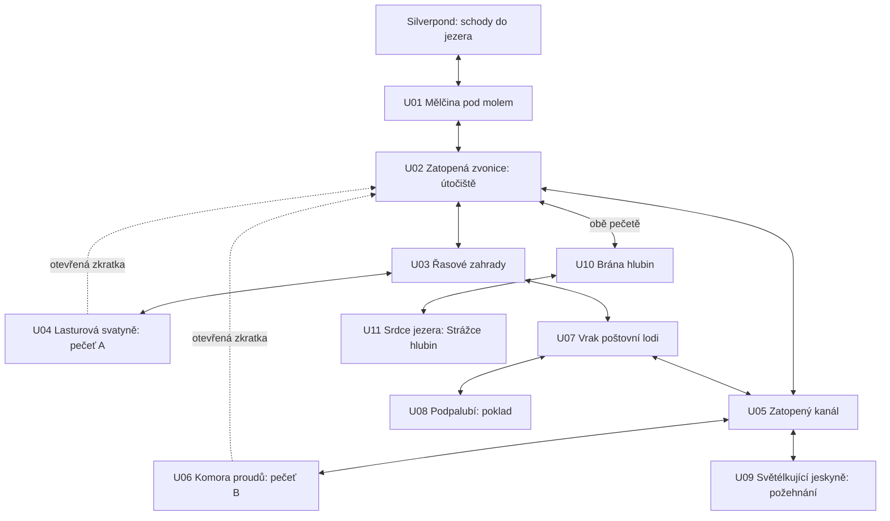

# Silverpond: Srdce hlubin

Návrh kapitoly a realizační plán · 6. září 2026

Původní plán z 6. září; aktuální implementace a odchylky jsou v [UNDERWATER_IMPLEMENTATION.md](UNDERWATER_IMPLEMENTATION.md) a učební aplikace v [SILVERPOND_LEARNING_DESIGN.md](SILVERPOND_LEARNING_DESIGN.md). K 8. září je zapojeno všech jedenáct místností. U09–U11 a souvislý ponor mezi bránou a srdcem jezera popisuje [UNDERWATER_FINALE.md](UNDERWATER_FINALE.md), včetně výsledků ověření a dosud chybějících finálních animací nových tvorů.

## 1. Záměr a rozsah

Po osvobození jezerní víly získají hrdinové kouzelnou šupinu, skočí z nábřeží Silverpondu pod hladinu a objeví zatopené město. Dvě staré svatyně zadržují proudy vedoucí do hlubin. Jejich pečetě lze získat v libovolném pořadí. Vedle hlavní cesty jsou propojené odbočky s vrakem, poklady a světélkující jeskyní. V závěru hráči osvobodí Strážce hlubin, kterého ovládá druhý velký krystal ze Zyxovy lodi.

Rozsah vychází z aktuálního lesního putování v produkčních datech, nikoli ze starších tabulek vyvážení v design dokumentu:

| Obsah | Současný les | Navržené podvodní dobrodružství |
|---|---|---|
| Průzkumné místnosti | 7 | 11, z toho 8 na hlavním postupu a 3 volitelné |
| Běžné souboje | 4 | 4 hlavní + 2 volitelné |
| Finální boss | 1, tři fáze | 1, tři fáze |
| Puzzly | Dva mosty, zámek truhly, rituál u strážce | 2 hlavní + 2 volitelné, čtyři různé mechanismy |
| Truhly | 2 | 4, včetně jedné větší zamčené |
| Bezpečná místa | Tábor | Centrální útočiště + odpočinek před bossem |
| Struktura | Převážně lineární | Dvě hlavní větve, spojovací cesta přes vrak, odemykané zkratky |

Cílová délka je přibližně 30–45 minut hlavní cesty a 45–60 minut se všemi odbočkami, klidně rozdělených do více sezení. Jde o návrhový cíl k ověření playtestem, nikoli změřenou dobu. Délku budeme upravovat počtem kol soubojů a opakování puzzlů, ne prodlužováním přesunů.

## 2. Návaznost na existující hru

Ověřeno v současném kódu a datech:

- `SilverpondFairyRewardScene` již předává **Kouzelnou šupinu** jako trvalou schopnost. Kontrolní příznak je `storyProgress.hasWaterBreathingScale`.
- Odměna je navázaná na dokončení třetí místní arény Silverpondu, globálně arény 6. `shouldBackfillLakeFairyReward()` pokrývá starší dokončené savy.
- `SilverpondQuestDialog` již mluví o **druhém velkém krystalu na dně jezera**. Pokračování zachová toto označení. Starší tabulka lodních fragmentů v hlavním design dokumentu používá jiné číslování; při implementaci sjednotit příslušnou část dokumentace.
- Město má funkční produkční scénu s historickým názvem `SilverpondTownMockScene`. Název není důvod přejmenovávat její scene ID nebo narušovat návazné savy.
- Na spodním středu hotového pozadí města jsou schody do vody. Jsou vhodným vstupem; celé město není nutné překreslovat.
- Čtyři vodní nepřátelé již mají definice a bojové spritesheety: Bublinový rak, Stříbroploutvý šupináč, Mlýnský krunýřník a Ruinový mlok.
- Perlová medúzka i Krystalový had již mají výtvarné koncepty. Pro tuto kapitolu ještě potřebují produkční animace a registraci.
- Aktuální učební systém pracuje s pásmy A–E pro sčítání a odčítání. Starý design dokument přisuzuje Silverpondu násobilku, ale její zavedení není součástí tohoto plánu.

### Vstup z města

1. Po přidělení šupiny se nad schody k vodě objeví šipka dolů a popisek **PONOŘIT SE**. Místo má dotykovou plochu zapsanou v `scenes.json`; efekt vody ji nepřekrývá.
2. První klepnutí přivede postavy ke schodům a spustí krátké Zyxovo vysvětlení. Hráč může jednotlivé repliky rychle odkliknout.
3. Tlačítko **DO VODY** spustí krátký skok, šplouchnutí a přechod pod hladinu. Druhý hráč a mazlíčci projdou stejným přechodem.
4. Při dalším vstupu se vysvětlení neopakuje. Zyx jej může připomenout na vyžádání.
5. Šupina se nespotřebovává. Vstup je zdarma, bez nové zásoby, spotřeby many nebo kyslíkové časomíry.
6. Z mělčiny vede jasně označená šipka nahoru zpět do města. Rozpracované dobrodružství zůstane uložené.

Návrh prvních replik:

> „Šupina od víly vám půjčí dech jezera. Pod vodou můžete zůstat, jak dlouho potřebujete.“
>
> „Druhý velký krystal rozbouřil Strážce hlubin. Musíme mu pomoct.“
>
> „U staré zvonice se cesty rozdělují. Najděte dvě pečetě — kterou první, je na vás.“

V sólu upravit oslovení na jednotné číslo. Po návratu s krystalem má Zyx novou závěrečnou repliku, nikoli původní pokyn hledat pečetě.

## 3. Mapa: dvě větve a skutečné propojení

Aktuální výtvarný kontrakt všech 11 místností, včetně počtu otvorů a rozlišení běžných cest od příchozích proudů: [UNDERWATER_PASSAGES.md](UNDERWATER_PASSAGES.md). Zahradu a kanál propojuje skutečný vrak U07 s odbočkou do U08. Vstup do U09 je otevřený; vrata do U10 čekají na obě pečetě.

Plné spojnice jsou obousměrné po splnění místních podmínek. Přerušované spojnice znamenají dodatečnou rychlou cestu zpět do útočiště. Vrátit se původní cestou lze vždy; žádná zkratka není jediným východem.

Vrak je volitelná spojnice mezi větvemi, takže hráč nemusí obě procházet přes centrální místnost. Získání pečetí má vlastní podmínky; vstup z opačné strany neobchází jejich hlídky ani puzzly. V jedné obrazovce jsou zpravidla nejvýše tři směry, každý s názvem cíle a odlišným symbolem.

### Místnosti a náplň

| ID / pracovní datové ID | Místo a atmosféra | Herní obsah |
|---|---|---|
| U01 `sp_shallows` | Mělčina pod molem; zespodu viditelné schody, světlo hladiny | Krátké seznámení s pohybem, první souboj se šupináčem, návrat do města |
| U02 `sp_bell_hub` | Zatopená zvonice a bezpečný kruh perleťového světla | Útočiště, léčení, mapa objevených cest, stojan na dvě pečetě; centrální návratový bod |
| U03 `sp_reed_garden` | Zahrady z řas, kořeny leknínů a drobné rybky | Hlavní hlídka Bublinového raka, malá truhla, cesty do svatyně a k vraku |
| U04 `sp_shell_shrine` | Lasturová svatyně s dvojicí perlových misek | Puzzle Rovnováha perel → pečeť A; otevření zkratky ke zvonici |
| U05 `sp_sunken_canal` | Kanál mezi starými domy, šipkami čitelné proudy | Rozcestí ke komoře, vraku a jeskyni; druhá malá truhla v průzkumném zákoutí |
| U06 `sp_current_chamber` | Komora starého vodního mechanismu | Hlavní souboj s krunýřníkem a mlokem; puzzle Oprav proudy → pečeť B a zkratka |
| U07 `sp_post_wreck` | Vrak malé jezerní poštovní lodi | Volitelný boj o třetí truhlu; propojení zahrad a kanálu, vstup do podpalubí. Průchod spojnicí nemusí spouštět boj o poklad |
| U08 `sp_wreck_hold` | Podpalubí se zbytky zásilek a mechanickým zámkem | Volitelný puzzle Pořadí zásilek; čtvrtá, větší truhla. Přístup k ní vyžaduje poražení hlídky vraku |
| U09 `sp_glow_grotto` | Tichá jeskyně se světélkujícími medúzkami | Volitelný souboj s Perlovou medúzkou; puzzle Světlo v jeskyni → pomoc pro závěrečný souboj |
| U10 `sp_depth_gate` | Monumentální vrata, stopy krystalové nákazy | Otevření dvěma pečetěmi, poslední hlavní souboj, pak bezpečný odpočinek a návratový bod před bossem |
| U11 `sp_lake_heart` | Výrazná přírodní průrva a krystal v bočním lůžku; příchod dlouhým ponorem mezi útesy | Třífázový boss, osvobození strážce, získání druhého velkého krystalu a závěr kapitoly |

Dvě malé truhly a bojová odbočka dávají mince/mana/drobné krystaly. Větší truhla má citelně lepší jednorázovou odměnu. Konkrétní čísla stanovit podle aktuální ekonomiky po aréně 6, ne podle zastaralých XP a diamantových tabulek lesa. Obsah truhel a bojové odměny musí být editovatelný v editoru, včetně many.

### Pravidla návratu a orientace

- Poražení nepřátelé se při přecházení mezi místnostmi neobnovují. Otevřené truhly zůstávají otevřené.
- Vyřešený mechanismus zůstává funkční; není nutné jej znovu řešit při návratu.
- Mapa ukazuje objevené místnosti, aktuální polohu, útočiště a nalezené pečetě. Dosud nenavštívené odbočky jsou naznačené, nikoli odhalené včetně pokladů.
- Brána má dvě viditelné zásuvky s tvarem pečetí; hráč pozná, co mu chybí, bez čtení dlouhého úkolu.
- Po získání obou pečetí ukáže zvonice cestu do hlubin. Vedlejší obsah zůstává dostupný i po bossovi.
- Odpočinek ve zvonici a před bossem doplňuje HP zdarma. Návraty nepřinášejí další loot ani měnu.

## 4. Čtyři puzzly

Puzzly nejsou zkoušky s medailemi. Cílem je porozumění a otevření prostředí. Všechny lze řešit bez časového limitu a bez poškození za chybný pokus. Po chybě zachovat správné části a nabídnout postupnou nápovědu. Podporovat jak přetažení, tak **klepnout na předmět → klepnout na místo**.

### P1 — Rovnováha perel, povinný

Dvě lasturové misky mají mít stejný počet perel. Jedna ukazuje cílovou hodnotu, druhá má již několik perel a jedno prázdné místo pro volbu.

- Příklad z vyššího rozsahu: **7 + ? = 12**, výběr 3 / 5 / 6. V nejnižším pásmu např. **2 + ? = 5**.
- Tři krátká zadání; misky se po odpovědi názorně vyrovnají.
- Čísla i počet názorných perel se řídí učebním pásmem hráče.
- Výsledek: perlová pečeť A a rozsvícení prvního světla zvonice.

### P2 — Oprav proudy, povinný

Hráč otočením tří velkých částí potrubí přivede proud od pramene k vodnímu kolu. Voda teče až po spuštění mechanismu; chybná sestava ukáže místo přerušení. Po propojení chybí energie pro rozběhnutí: **8 − ? = 3** nebo jednodušší varianta pro dané pásmo.

- Spojuje prostorové uvažování s jedním krátkým výpočtem; samotné otáčení potrubí se nezapočítává jako správný matematický příklad.
- Díly mají pevné pozice, několik jasných natočení a velké dotykové plochy. Žádné přesné trefování pohybujícího se předmětu.
- Výsledek: proudová pečeť B; obnovený proud zpřístupní zkratku.

### P3 — Pořadí zásilek, volitelný

Na poštovní truhle zůstaly tři zásilkové destičky. Hráč je seřadí podle hodnoty od nejmenší po největší. Např. **8 − 5**, **2 + 3**, **9 − 2**; výsledky jsou 3, 5, 7. V jednodušší variantě lze nejdřív použít přímo čísla a názorné skupinky.

- Každou početní kartičku nejprve vyřešit samostatně, poté řadit; pokusy lze poctivě připsat konkrétním příkladům.
- Losování zajistí různé výsledky, jednoznačné pořadí a řešení v povoleném rozsahu.
- Výsledek: větší truhla. Puzzle není nutné pro vstup k bossovi.

### P4 — Světlo v jeskyni, volitelný

Čtyři zrcadlové mušle vedou paprsek přes dvě malé perly do cílové lastury. Světelný proud názorně ukazuje aktuální směr. Ze 256 nastavení má jedno řešení; přímá cesta bez rozsvícení obou perel nestačí. Jde o čistě prostorový puzzle; do počtu matematických příkladů se nepřičítá.

- Výsledek: **Požehnání perly**, které ztlumí první silnou vlnu v každém pokusu o bosse.
- Bonus je trvalý pro tuto kapitolu, nespotřebuje se neúspěšným pokusem a není nutný k vítězství.
- Základní obtížnost bosse vyvažovat bez tohoto bonusu.

### Učení a co-op

Číselné úlohy včetně soubojů vycházejí ze skutečného postupu příslušného hráče. Nevynucovat násobení, tři operandy ani přeskočení do vyššího pásma jen kvůli novému prostředí. Doplnění chybějící části použít v rámci forem, které už daný hráč procvičuje; první vysvětlení má názornou jednodušší variantu.

V co-opu se početní kroky střídají mezi hráči a úloha nese vlastníka. Jeden zobrazený příklad má jeden započítaný výsledek v profilu svého řešitele; druhý hráč nedostává kopii téhož pokusu. Nápovědou dokončené a opakované pokusy je nutné odlišit od první správné odpovědi, aby nezvyšovaly neoprávněně jistotu v učivu. Prostorové kroky lze řešit společně, bez požadavku na současný stisk dvou prstů.

## 5. Strážce hlubin

Pracovní identita: **Nerion, Strážce hlubin**. Výtvarným základem je existující koncept Krystalového hada: jezerní had/drak s perleťovým břichem, ploutvovou korunou a krystaly na hřbetě. Je to ochránce jezera zmatený Numerou. Vítězství má podobu osvobození, ne zabití.

Druhý velký krystal leží za ním v lůžku staré svatyně. Fialové proudy z něj míří do hřbetních krystalů strážce. Hráč tak přímo vidí zdroj problému a předmět, který nakonec získá.

| Fáze | Vzhled a mechanismus | Co má hráč pochopit |
|---|---|---|
| 1. Zakalený strážce | Pomalé výpady, běžný útok a obrana, slabší fialové žíly | Známý souboj v novém prostředí |
| 2. Rozbouřené proudy | Strážce předem zvedne ploutve a zobrazí symbol vlny; silnější útok přijde v příštím nepřátelském tahu | Rozpoznat ohlášený útok a využít známé blokování. Žádná nová reflexní zkouška |
| 3. Praskající pouto | Viditelné krystalové pouto, jehož pevnost ubírá běžné poškození; po prolomení ukončit útoky a přejít k osvobození | Výpočty pomáhají strážci osvobodit se od krystalu |

Třetí fázi modelovat jako poslední zásobu HP s odlišnou prezentací; nezavádět skrytou druhou podmínku typu „sedm příkladů správně v řadě“. Fáze mají jednoznačný ukazatel 1/3, 2/3, 3/3. Mezi fázemi krátká klidová pauza a malé předem nastavené léčení. Přesné HP/útok/obranu i léčení odladit simulací a playtestem.

V co-opu zůstává jeden společný boss, střídání tahů a samostatné zdraví hráčů. Upravené HP musí platit ve všech třech fázích. Parametry a pravidla ukládat do `encounters.json`, základ nepřítele do `enemies.json`; runtime a simulátor mají používat stejná data. Obrana se odečítá jednou z celého útoku pomocí stávajícího systému.

### Závěr kapitoly

1. Porážku bosse a nárok na příběhovou odměnu uložit ještě před přechodem do závěrečné scény.
2. Pouto praskne, proudy se vyčistí, strážce získá pokojnou podobu a poděkuje.
3. Hráč získá **Krystal hlubin — druhý velký krystal pro Zyxovu loď**. Jde o trvalý příběhový předmět; nevyužívá omezenou kapacitu běžného inventáře krystalů.
4. Otevře se bezpečný proud na povrch. Následuje krátký rozhovor se Zyxem a uložení dokončené kapitoly.
5. Naznačit stopu k další oblasti. Nevytvářet aktivní východ vedoucí do zatím neimplementované kapitoly ani povinné nové minihry kolem instalace krystalu.

## 6. Jak má voda vypadat a fungovat

### Výtvarný směr

Zachovat měkkou, ručně malovanou pohádkovou stylizaci Silverpondu, výrazné siluety a patinované zlato. Je to kouzelné sladkovodní jezero: řasy, leknínové kořeny, mušle, kamenné ruiny a jezerní živočichové. Výrazné mořské korálové útesy nejsou hlavním motivem.

- **Mělčiny:** jasný tyrkys, teplé zlaté světlo, sluneční obrazce na kamenech. Viditelná hladina vytváří návaznost na město.
- **Zahrady a kanály:** petrolejová modř, zelené řasy, bledé kamenné zdi a mosazné mechanismy. Vrak má teplé dřevo jako orientační bod.
- **Hlubiny:** tmavší modř a svítící perly; tvary a východy zůstávají čitelné. Fialová označuje vliv krystalu, ne všechny dekorace.

Jedna místnost se skládá z odděleného vzdáleného pozadí, architektury, interaktivních objektů, postav, omezeného popředí a jemných vodních efektů. Pozadí nesmí mít namalovanou truhlu, se kterou má hráč později hýbat nebo ji otevřít. Texty, čísla a cíle puzzlů kreslí hra.

### Pohyb hrdinů

Doporučuji **kouzelné vznášení a plavání po čitelných trasách**. Klepnutí určí místo; postava k němu doplave. V každé místnosti jsou autorské vodorovné i šikmé cesty a podle potřeby krátký vertikální úsek. Hráč nepotřebuje řídit vztlak ani držet směr joystickem.

Prototyp může použít současný idle sprite uvnitř lehké magické aury. Produkční průzkum dostane skutečné vodní idle a pohybové animace pro oba hrdiny, aby postavy ve vodě neběžely. Ochranná šupina a jemný proud kolem těla vysvětlují, jak zvládnou pohyb v brnění. Mazlíčci mají stejný ochranný efekt a následují bezpečnou trasu.

Souboje probíhají nad čitelnou kamennou terasou, s malým vznášením postav a známými bojovými animacemi. Matematická tabule a její texty zůstávají stabilní a ostré. Vodní vlnění patří do prostředí, nikoli přes čísla, tlačítka a zásahové plochy.

### Tablet a výkon

- Rozvržení nadále vychází z 1280 × 720, se zvětšenými plochami pro dotyk a bez závislosti na hoveru. Směry se nesmějí překrývat s HUD nebo spodním okrajem tabletu.
- Nejdříve vyrobit jednu složenou místnost a otestovat ji na Samsung tabletu v Chromu; z ní odvodit velikosti textur a počet efektů pro zbytek.
- Jemné světelné obrazce, bubliny a paprsky stavět z malých opakovaně použitelných vrstev. Vyhnout se celoplošnému rozostření a nákladnému lomu obrazu.
- Rozdělit načítání na jádro hry a balíčky kapitol. Podvodní textury/animace se načítají při vstupu do kapitoly; město a menu na ně nečekají. Zobrazit průběh a možnost opakování při chybě načtení.
- Po kompresi měřit i rozbalenou paměť textur a nejdelší rozměr spritesheetu. Příliš široké pásy rozdělit do mřížky nebo více listů při zachování rozměrů jednotlivých snímků.
- Cíl: plynulé ovládání, alespoň stabilních 30 FPS na testovaném tabletu, ideálně 60. Změřit v místnosti s oběma hráči, mazlíčky, efekty a v bossově nejnáročnější fázi.

## 7. Assetový plán

Počty níže jsou výrobní odhad. „Sada“ znamená kanonický objekt plus potřebné stavy, nikoli jeden samostatný generovaný obrázek pro každou variantu.

| Balík | Nová výroba | Co využít / poznámka |
|---|---|---|
| Koncepty a vzhled | 3 klíčové pohledy: mělčina, zvonice, bossova síň; 1 složená zkušební obrazovka | Referencí současné město, vodní aréna a schválené koncepty tvorů |
| Prostředí U01–U11 | 9 základních kompozic + 2 odvozené varianty = 11 místností | Svatyně využije sadu zahrad; brána sadu zatopené architektury. Varianty musí mít odlišnou kompozici a orientační bod |
| Bojová prostředí | 4 čitelné kompozice: mělčina/zahrady, ruiny, jeskyně, boss | Odvodit z odpovídajících místností a společných vrstev; nelze jen libovolně oříznout pozadí přes spawn místa |
| Architektura a dekorace | Přibližně 14 modulů | Řasy, kořeny, sloupy, oblouky, schody, kameny, potrubí, části vraku, mušle; reuse a omezené varianty |
| Truhly | 2 sady × zavřená/otevřená | Menší zarostlá a velká poštovní; zámek je samostatná vrstva |
| Puzzle objekty | Přibližně 12 rodin dílů | Perlové misky a perly, části potrubí, kolo, destičky a sloty, mušlová zrcadla, zdroj a cíl světla |
| Postup a příběh | 2 pečetě, 1 společný stojan/brána, 1 odpočinkový objekt, 1 velký krystal | Šupina a Zyx již existují. Stavy neaktivní/aktivní sdílejí geometrii |
| Nový běžný nepřítel | Perlová medúzka: idle, útok, zásah/obrana, osvobození | Vychází z existujícího konceptu; ostatní čtyři bojoví tvorové se použijí z katalogu |
| Boss | Kanonická podoba + přibližně 6 sekvencí | Idle, útok, ohlášení vlny, zásah, protržení pouta, klidný idle; fáze mohou sdílet základ a samostatné efekty |
| Hrdinové | 2 postavy × 2 vodní animace | Vodní idle a pohyb; zachovat obličej, proporce a výbavu existujících postav |
| UI a mapa | 1 sada směrových ikon, 1 sada mapových značek, ikony pečetí | Reuse existujícího rámu a `MedievalActionButton`; runtime popisky |
| VFX | Asi 6 malých sad | Bubliny, světelné obrazce, vodní paprsky, šplouchnutí, krystalové pouto/prasknutí, ochranná aura |
| Zvuk | 2 ambientní vrstvy, 1 bossova skladba, přibližně 8 krátkých efektů | Nejprve audit toho, co už hra má; krátké zvuky pro proud, truhlu, pečeť, puzzle a osvobození |

### Pořadí výtvarné výroby

1. Uzavřít barevnost, velikost postav, perspektivu a bezpečná místa pro HUD na jedné složené místnosti. Pro první porovnání vytvořit dvě varianty síly vodních efektů.
2. Vyrobit hratelný balík: městský vstup, mělčina, zvonice, jeden puzzle, jedna truhla, jeden již existující nepřítel, vodní pohyb obou hrdinů.
3. V samostatném kroku ověřit kanonickou podobu a pohyb bosse. Dlouhé tělo a široké efekty jsou největší animační riziko; řešit je před výrobou všech lokací.
4. Teprve po ověření složeného obrazu a výkonu vyrobit zahrady/ruiny/vrak po souvisejících balících.
5. Dokončit jeskyni, medúzku, bossovy fáze a závěrečné očištění prostředí.

Pro animace postav a tvorů dodržet `docs/ASSET_CREATION.md`: skutečný image-to-video zdroj, kontrola celého videa před extrakcí, uzamčená kamera a měřítko, žádné ořezy těl ani efektů, jedna transformace všech snímků a společný canvas. Východiskem je ověřený postup Bublinového raka; jednotlivé snímky se nesmějí normalizovat nezávisle.

Pro UI použít společný rám, samostatné ikonové stavy, runtime text a stabilní zásahové plochy. Párové stavy generovat společně se shodnou geometrií. Všechny statické hosty evidovat v `scenes.json` a číst jejich polohy/hloubky přes `SceneBuilder`. Nová kapitola nepřináší vlastní konkurenční systém tlačítek.

## 8. Technický plán

### Co převzít a co doplnit

Z lesa převzít princip místností, interakce až po příchodu, návrat ze souboje, stav objektů a waypointy. Specifické jednosměrné chování lesního mostu nepřenášet do podvodní mapy. Pro první verzi vytvořit samostatnou scénu `UnderwaterRoomScene` se sdílenými pomocnými funkcemi; velkou přestavbu existujícího lesa nepodmiňovat vznikem nové kapitoly.

| Součást | Plánovaná odpovědnost |
|---|---|
| `SilverpondTownMockScene` | Podmíněný vstup do vody, Zyx, návrat z kapitoly |
| `UnderwaterRoomScene` | Průzkum, dvě postavy, interaktivní předměty, cesty a přechody |
| `UnderwaterProgressSystem` | Uložený stav kapitoly, brány, pečetě, návratové body, jednorázové události |
| Puzzle komponenty / `UnderwaterPuzzleScene` | Čtyři mechanismy se stejným ovládáním a návratovým kontraktem |
| Existující `BattleScene` | Vodní prostředí, co-op, běžné boje a datově řízený boss |
| Závěrečná scéna / společná odměnová komponenta | Osvobození strážce a převzetí velkého krystalu |
| `underwater-rooms.json` | Graf místností, stabilní ID objektů, podmínky cest, odkazy na layout/puzzle/encounter |
| `underwater-puzzles.json` | Konfigurace mechanismů, šablony a povolené hodnoty |
| `scenes.json` | Jediný zdroj vizuálních souřadnic, hloubek, rozměrů a spawn bodů; data místností odkazují na ID těchto hostů |
| `encounters.json` | Všechny sestavy, bojové odměny, fáze bosse a pravidla co-opu |
| `enemies.json` + katalogy assetů | Stabilní nepřátelská ID, základní statistiky, textury a animace |

Pro větvení zavést explicitní `exitId → targetRoomId + targetEntryId`. Samotné `fromDirection` nestačí, když do jedné místnosti vedou dva vchody z téže strany. Přechody mají pojistku proti okamžitému návratu a spawn umístěný mimo aktivní odchodovou zónu. Data pohybových tras musí být také upravitelná v editoru.

### Ukládání od začátku

`JourneySystem` nyní drží rozpracovanou výpravu v `currentJourney` uvnitř singletonu. Uložení hráčova HP není automaticky uložením mapy, truhel a vyřešených puzzlů. Pro podvodní kapitolu proto přidat verzovaný stav přímo do save dat profilu.

Minimálně uložit:

- `schemaVersion`, `chapterId`, aktuální místnost a vstup/návratový bod;
- navštívené místnosti, poražené encountery, otevřené truhly;
- dokončené puzzly a jejich již vyhodnocené kroky, aby reload nepřidal tentýž pokus znovu;
- obě pečetě, odemčené zkratky, požehnání a odpočinkové body;
- ukončený Zyxův úvod, poražený boss, nárok na krystal a převzatý krystal;
- jednoznačné identifikátory připsaných odměn, které brání duplikaci.

Uložit po souboji, změně puzzle, získání odměny, aktivaci pečeti, změně místnosti a odpočinku. Starým savům bez kapitoly přidat prázdný stav; export/import musí nový stav zachovat. Nejde o serverovou databázovou migraci, ale o kompatibilní rozšíření lokálních save dat.

Při zavření/reloadu uprostřed souboje se obnoví poslední bezpečný stav a daný souboj začne znovu. Již zaznamenané matematické pokusy zůstávají skutečnou aktivitou; nedokončený boj nepřidá odměnu. Po porážce se hráči vrátí k poslednímu odpočinku, zachovají vyřešené puzzly a otevřené truhly. Závěrečnou odměnu musí být možné bezpečně dokončit i po přerušení animace.

### Solo a co-op od první hratelné verze

- Místnosti mají jednu společnou kameru a jednu sdílenou cestu; oba hráči se pohybují jako družina. Boje nadále používají stávající střídání tahů.
- Doporučená politika pro různě rozehrané profily: svět a místo pokračování určuje hráč A. Pokud má šupinu, její ochrana po dobu společné výpravy pokrývá i hráče B. B tím automaticky nezíská trvalý příznak dokončené arény; ten mu uděluje jeho vlastní postup arénou.
- Nově společně dokončené události se zapíší oběma účastníkům. Každý získá jednorázovou odměnu jen pokud ji ještě nemá; pouhé připojení ke starší rozehrané mapě nepřidělí její minulé poklady zpětně.
- Při sólovém pokračování se mapa rekonstruuje z vlastního profilu. Neslučovat savy obou hráčů jako jeden nerozlišený stav; HP, mince, mana, učební postup a odměny mají vlastníka.
- Součást napojení: `CoopSetupScene` zatím startuje napevno `TownScene`. Doplnit regionální pokračování pro hostitele a společnou cestu odměny od víly; nestačí rozšířit jen sólovou větev vítězství.
- Výsledky z podvodních početních úloh i bojů musí být vidět v Denním pokroku a přispívat ke skutečnému postupu obou profilů.

### Scene Editor a katalog soubojů

Současné schéma hry i validátor editoru předepisují právě tři položky `sceneOrder`: `ArenaScene`, `ForestRoomScene`, `ForestMapScene`. Přidání podvodních encounterů proto není pouze doplnění JSON.

Naplánovat společné rozšíření hry a editoru: novou volitelnou skupinu `UnderwaterRoomScene` přidat až za dosavadní tři, zachovat jejich pořadí a ID. Při změně verze musí nová čtečka načíst i současný dokument a nová data smí editor zapisovat teprve po rozšíření validace. Editor umožní upravovat sestavy, bossovy fáze, odměny včetně many a ukáže související pokoj.

Rozšířit i `ProductionEncounterAdapter` a simulaci tak, aby četly stejné definice. Nevytvářet `underwater-enemies.json`, pevné kopie bossových statistik ve scéně ani druhý katalog soubojů. Tato změna bude vyžadovat aktualizaci dokumentovaného kontraktu v `AGENTS.md` a editoru při realizaci.

## 9. Etapy a podmínky dokončení

| Etapa | Výstup | Kdy je hotová |
|---|---|---|
| 1. Návrh a vizuální základ | Definitivní graf, pravidla bran, 3 klíčové koncepty, složený vodní look a návrh strážce | Místnosti, postavy, čísla i východy jsou čitelné; zvolená míra vodních efektů |
| 2. Ukládání a graf bez finálního artu | Stav kapitoly, migrace starého savu, obousměrné vchody, pravidla co-opu, rozšířený editor/katalog | Reload, návrat ze souboje a změna pořadí větví neztratí postup a nevytvoří odměnu dvakrát |
| 3. Malý hratelný úsek | Město → Zyx → ponor → mělčina → zvonice → jedna ukázka puzzle/boje/truhly → město | Funguje solo i co-op, učení se zapisuje, hraje se na tabletu s finálním ovládáním |
| 4. Obě hlavní větve | Zahrady, svatyně, kanál, komora, dvě pečetě a zkratky | Lze dokončit A→B i B→A; cesta přes vrak se správně napojuje a brána vyžaduje obě pečetě |
| 5. Odbočky a hlavní art | Vrak, podpalubí, jeskyně, čtyři truhly, medúzka, kompletní prostředí | Volitelné odměny jsou užitečné, orientace srozumitelná, žádné opakované povinné souboje při návratu |
| 6. Boss a závěr | Tři fáze, požehnání, očištění, krystal, návrat k Zyxovi | Vítězství je dosažitelné bez odboček; ukončení/pokračování nepřidělí krystal znovu |
| 7. Vyvážení a tabletový playtest | Simulace i reálné hraní hlavních tras, kontrola výkonu a načítání | Splněná kontrolní kritéria níže, připravené hratelné savy pro začátek/střed/bosse |

Etapy 2 a 3 potřebují spolupráci s editorem; plošná výroba assetů z etap 4–6 se odvíjí od ověřeného looku a výkonu. Animační zkoušku bosse udělat již v etapě 1, aby se nejdražší výtvarné riziko neobjevilo až na konci.

## 10. Kritéria playtestu a dokončení

- Čerstvě dokončená aréna i starší save s arénou 6 zpřístupní ponor. V sólu ani jako hostitel se hráč bez šupiny do vody omylem nedostane; host v co-opu smí využít popsanou společnou ochranu.
- První Zyxův úvod jde odklikat, po návratu se neopakuje; přerušení během ponoru nezanechá zamčené ovládání.
- Projít hlavní trasy v obou pořadích, využít i obejití přes vrak a všechny zkratky. Z žádného legálně dosaženého stavu nevznikne slepá past bez návratu.
- Cíleně ověřit, že alternativní vstup neobchází podmínku pečeti a jedna pečeť nestačí na finální bránu.
- Testovat reload po truhle, během puzzle, po pečeti, po bossově vítězství a před převzetím krystalu; ověřit také export a import uprostřed kapitoly.
- Ověřit solo i dva různé profily v co-opu: jiná pásma učiva, jedna již dokončená odbočka, jiná zásoba many, výměna hostitele, pád jednoho hráče a porážka celé družiny.
- Početní pokusy se připisují svému řešiteli; úroveň a denní přehled jsou po novém načtení stejné. Prostorové puzzly nefalšují počty příkladů.
- Všechny truhly a krystal jsou jednorázové, opakovaný přechod ani opakovaná callback funkce nepřidá odměnu znovu.
- Simulovat obě pořadí hlavních větví, cestu bez bonusu z jeskyně i s bonusem a odpovídající co-op. Sílu nepřátel odvodit od aktuálních save profilů po aréně 6; nevyžadovat dokonalou přesnost nebo konkrétního mazlíčka.
- Na Samsung tabletu v Chromu ověřit fullscreen, klepnutí i přetažení, obnovu po uspání, delší průchod, paměť textur, znovunačtení při slabší Wi-Fi a vizuálně nejnáročnější fázi bosse.
- Před testy rozšíření dat zkontrolovat migrační závislosti; následně provést cílené testy katalogu/save stavů, existující testy lesa/arén/co-opu a vizuální kontrolu nových scén.

## 11. Zdrojové podklady

- Aktuální rozsah lesa: `public/assets/data/forest-rooms.json`, `public/assets/data/encounters.json`.
- Návaznost Silverpondu: `src/systems/SilverpondProgressSystem.ts`, `src/systems/StorySystem.ts`, `src/ui/SilverpondQuestDialog.ts`, `src/scenes/SilverpondFairyRewardScene.ts`.
- Město: `src/scenes/SilverpondTownMockScene.ts`, `public/assets/images/mock/silverpond-town/silverpond-town-hub.webp`.
- Room state a přechody: `src/systems/JourneySystem.ts`, `src/scenes/ForestRoomScene.ts`, `docs/MOVEMENT_SYSTEM.md`.
- Katalog a editor: `src/types/encounters.ts`, `src/systems/EncounterCatalog.ts`, `/Users/datamole/SimpleGame/scene-editor/src/types/encounter.types.ts`.
- Výtvarné reference: `public/assets/images/concepts/silverpond-creatures/`, `public/assets/sprites/silverpond/`, `docs/ASSET_CREATION.md`.
- Starší příběhový rámec: `docs/GAME_DESIGN_DOCUMENT.md`, `docs/FOREST_DESIGN.md`; při rozporu má přednost aktuální hra a zadání této kapitoly.
